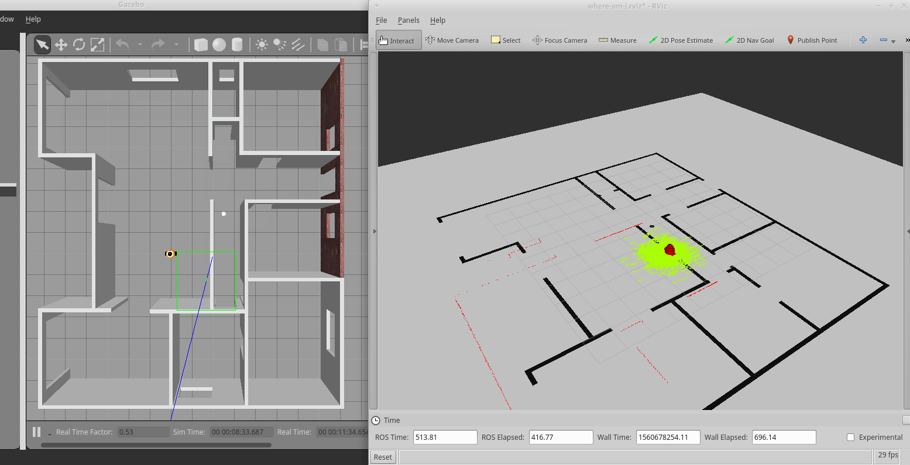

# Gazebo-ROS lab

## Where-am-i

A localization project using ROS AMCL package to accurately localize a mobile robot inside a map in the Gazebo simulation environments.

Launch world and RViz: `roslaunch my_robot world.launch`

Launch amcl: `roslaunch my_robot amcl.launch`

run teleop: ` rosrun teleop_twist_keyboard teleop_twist_keyboard.py`

### The robot localizing it self

### Map creation from Gazebo world using PGM creator (if needed: world modified/updated)

Installing dependencies: `sudo apt-get install libignition-math2-dev protobuf-compiler`

Cloning pgm_map_creator package: `git clone https://github.com/udacity/pgm_map_creator.git ./src/pgm_map_creator`

Copy gazebo world: `cp <GAZEBO WORLD FILE> src/pgm_map_creator/world/`

Insert the map creator plugin : insert `<plugin filename="libcollision_map_creator.so" name="collision_map_creator"/>` before `</world>`

Create the pgm map: `gzserver src/pgm_map_creator/world/<GAZEBO WORLD FILE>`

 launch the request_publisher node (in another terminal) : `roslaunch pgm_map_creator request_publisher.launch`

## Go-chase-it

A differential drive robot with two sensors: a lidar and a camera.
It has a "mission" of chasing a white ball based on the camera image: it assumes that among all elements of the robot world, only the chased ball is of white color therefore it simply determines the presence and position of a white ball through scanning the
sensed image an searching for the white pixels location. If a white ball exists in the image, a `process_image` C++ node requests
a `ball_chaser/command_robot` service provided by another C++ node called `drive_bot` to drive the robot towards it.

The robot is housed in a 14m x 12m one floor flat.

### Launch ball_chaser package

Launch ball chaser: `roslaunch ball_chaser ball_chaser.launch`

<!-- ## Robot and world (top) overview
 -->

### The robot chasing

