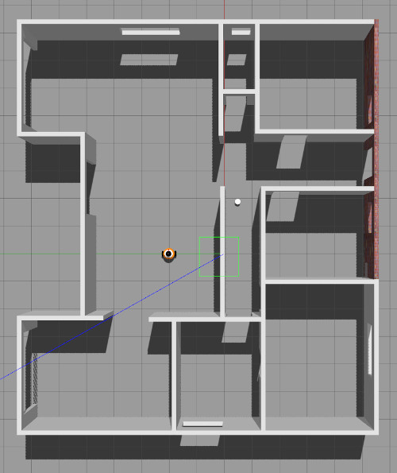

# Go-chase-it

A differential drive robot with two sensors: a lidar and a camera.
It has a "mission" of chasing a white ball based on the camera image: it assumes that among all elements of the robot world, only the chased ball is of white color therefore it simply determines the presence and position of a white ball through scanning the
sensed image an searching for the white pixels location. If a white ball exists in the image, a `process_image` C++ node requests
a `ball_chaser/command_robot` service provided by another C++ node called `drive_bot` to drive the robot towards it.

The robot is housed in a 14mx12m one floor flat.

# Robot and world (top) overview

# The robot chasing

