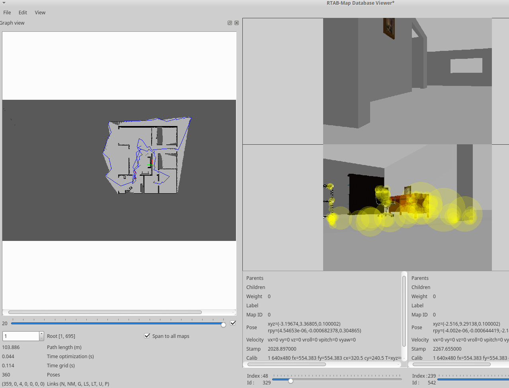
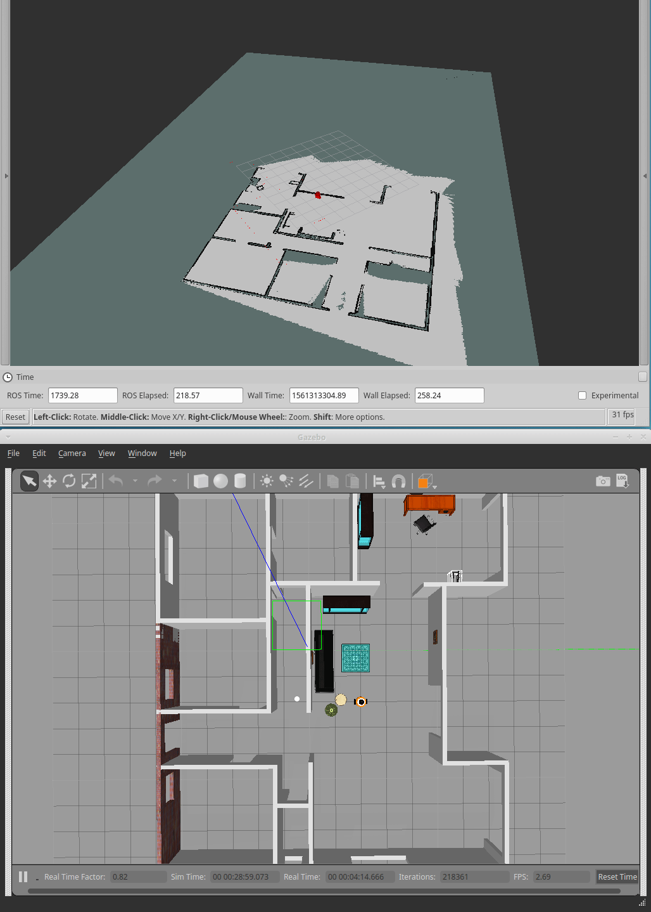

# Gazebo-ROS lab

## Map-my-world

A SLAM project where a 2D occupancy grid and 3D octomap are created from a simulated environment using  with the RTAB-Map package. The robot world/housing is enriched with furniture from http://data.nvision2.eecs.yorku.ca/3DGEMS/ the enriched world file is ./src/my_robot/worlds/furnished_house_14x12_world.world.

### Getting/installing ROS packages (dependencies)

after cloning/getting teleop (using `./get_teleop.sh` script)

rtabmp_ros could be either installed using apt install: ` sudo apt-get install ros-kinetic-rtabmap-ros` or
by cloning from github using the provided script `./get_rtabmap_ros.sh`

### Launching

launching (enriched) world with robots: `roslaunch my_robot world.launch`

after cloning/getting teleop

Run teleop: ` rosrun teleop_twist_keyboard teleop_twist_keyboard.py` or using the launcher `roslaunch my_robot teleop.launch`, then launch either the  mapping mode or the localization mode.

Note that the localization mode needs the map generated in mapping mode, so you need to run the mapping mode to generate or update the map before running the localization mode

### Mapping mode
launching mapping  `roslaunch my_robot mapping.launch` then navigate using teleop for map generation

DB file https://www.dropbox.com/s/pu2i8u3p4pssj0g/rtabmap.db?dl=0

### Localization mode
launching the localization mode `roslaunch my_robot localization.launch`

## Where-am-i

A localization project using ROS AMCL package to accurately localize a mobile robot inside a map in the Gazebo simulation environments.

Launch world and RViz: `roslaunch my_robot world.launch`

Launch amcl: `roslaunch my_robot amcl.launch`

run teleop: ` rosrun teleop_twist_keyboard teleop_twist_keyboard.py`

### The robot localizing it self

### Map creation from Gazebo world using PGM creator (if needed: world modified/updated)

Installing dependencies: `sudo apt-get install libignition-math2-dev protobuf-compiler`

Cloning pgm_map_creator package: `git clone https://github.com/udacity/pgm_map_creator.git ./src/pgm_map_creator`

Copy gazebo world: `cp <GAZEBO WORLD FILE> src/pgm_map_creator/world/`

Insert the map creator plugin : insert `<plugin filename="libcollision_map_creator.so" name="collision_map_creator"/>` before `</world>`

Create the pgm map: `gzserver src/pgm_map_creator/world/<GAZEBO WORLD FILE>`

launch the request_publisher node (in another terminal) : `roslaunch pgm_map_creator request_publisher.launch`

## Go-chase-it

A differential drive robot with two sensors: a lidar and a camera.
It has a "mission" of chasing a white ball based on the camera image: it assumes that among all elements of the robot world, only the chased ball is of white color therefore it simply determines the presence and position of a white ball through scanning the
sensed image an searching for the white pixels location. If a white ball exists in the image, a `process_image` C++ node requests
a `ball_chaser/command_robot` service provided by another C++ node called `drive_bot` to drive the robot towards it.

The robot is housed in a 14m x 12m one floor flat.

### Launch ball_chaser package

Launch ball chaser: `roslaunch ball_chaser ball_chaser.launch`

<!-- ## Robot and world (top) overview
 -->

### The robot chasing

